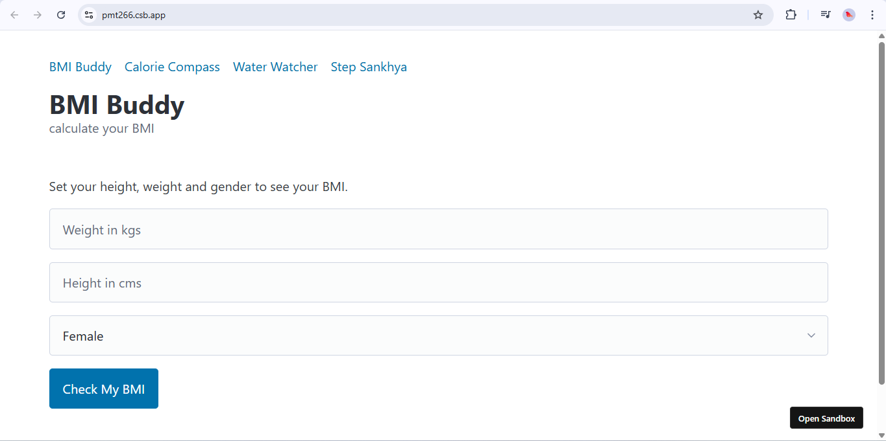
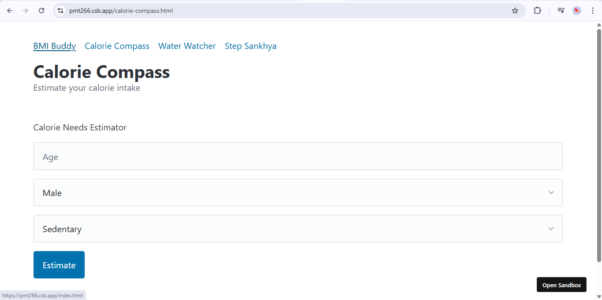
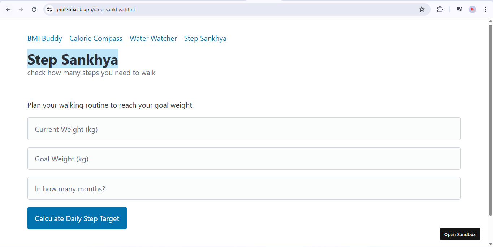
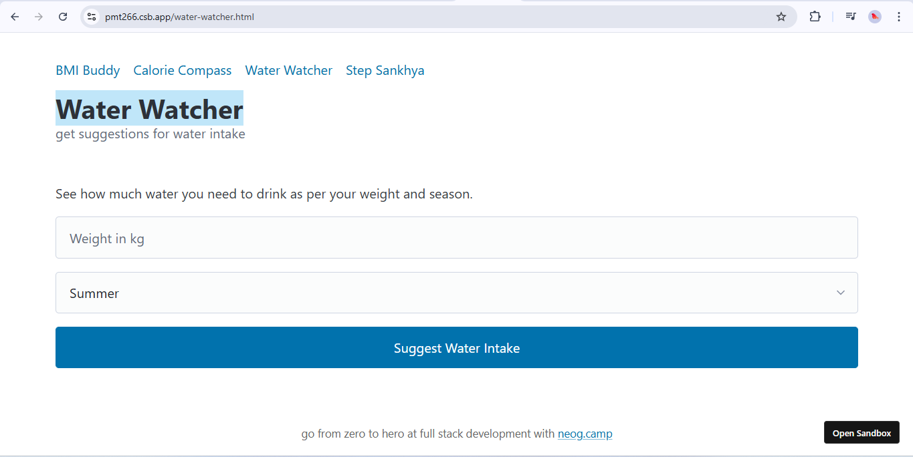

# FitKit - Your All-in-One Fitness Toolbox

FitKit is a comprehensive, easy-to-use web application designed to help you track, analyze, and improve your health and fitness journey. Whether you're monitoring your calories, checking your BMI, or keeping count of your daily steps, FitKit brings all essential tools together in one place.

## 🚀 Live Demo

[Try FitKit now!](https://fitkit-v1.netlify.app/)

---

## 🏋️‍♂️ Features

- **BMI Buddy**  
  Calculate your Body Mass Index and understand your weight category.

- **Calorie Compass**  
  Track your daily calorie intake and get insights for a healthier diet.

- **Step Sankhya**  
  Log your steps and visualize your physical activity effortlessly.

- **Responsive Design**  
  Optimized for desktop and mobile devices.

- **Simple, Intuitive UI**  
  Minimal and easy-to-navigate interface for everyone.

---

## 🖼️ Preview






---

## 📂 Folder Structure

```
FitKit/
│
├── assets/
│   ├── css/
│   │   └── main.css         # Core stylesheet for layout and design
│   ├── img/
│   │   ├── BMI Buddy.png
│   │   ├── Calorie Compass.png
│   │   └── Step Sankhya.png
│   └── pages/
│       └── ...              # App pages (details not shown)
│
├── README.md                # Project overview and instructions
└── ...                      # Other project files
```

---

## 🛠️ Getting Started

1. **Clone the repository:**
   ```bash
   git clone https://github.com/shivankushsingh09/FitKit.git
   ```
2. **Open the project:**
   - You can view the app by opening `index.html` in your browser.
   - Or visit the [Live Demo](https://fitkit-v1.netlify.app/) directly.

---

## 💡 Tech Stack

- HTML5
- CSS3
- JavaScript

---

## 📄 License

This project is licensed under the [MIT License](LICENSE.md).

---

## 🙌 Contributing

Pull requests are welcome! For major changes, please open an issue first to discuss what you would like to change.

---

## 👤 Author

Made with ❤️ by [shivankushsingh09](https://github.com/shivankushsingh09)
